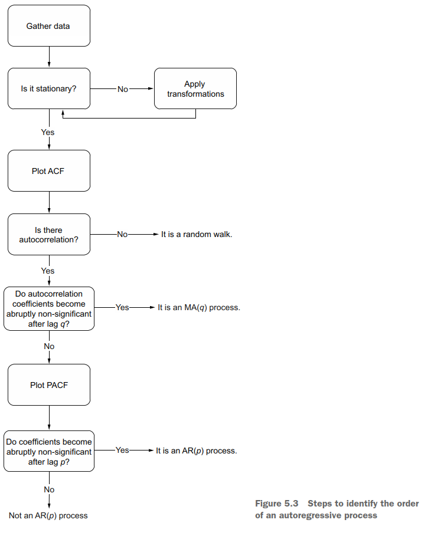

# Simulating a *Auto-Regressive* process in time series
The purpose of this reppository is learning to identify an Auto-Regressive process. In order to do that, the definition and the process to identify this sort of series is presented. The next diagram shows the general process:

An AR(2) process will be simulated using the equation:
$$y_t = 0.33 y_{t-1} + 0.50 y_{t-2} $$
The actions to execute are:
1. Gather data: Simulate de AR(2) model with the above equation.
2. Test stationary.
    - Apply transformations until our series is stationary.
4. Plot ACF: Is it slowly decaying?
5. Plot the PACF:get the order of our AR model.
6. Make forecasts over the test: use rolling forecast with a window lenght of the AR's order.
7. Plot forecasting.

Bibliography:
- Peixeiro, M. (2022). Time Series Forecasting in Python (1st ed., Chapter 4, pp. 81-100). Manning Publications.
